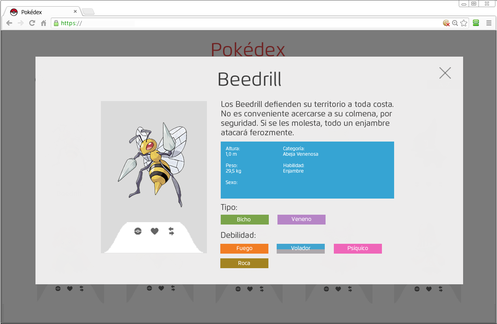

# pokedex
This is the evaluated exercise, using AJAX-API

- De acuerdo a la página Pokedex.org realizar un clon remasterizado
* Analizar la documentación en http://pokeapi.co/docsv2 *
- Usar JSON View para obtener la información de PokeApi y poder entenderla
- PokeApi no da imágenes de los pokemon
- Mostrar el detalle de Pokemon en un modal, no recargar la imagen para detalle

